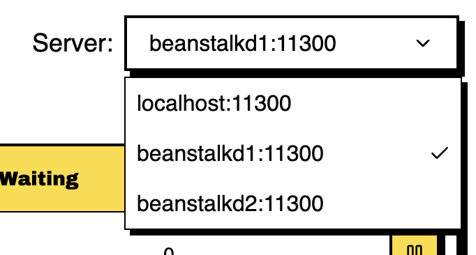
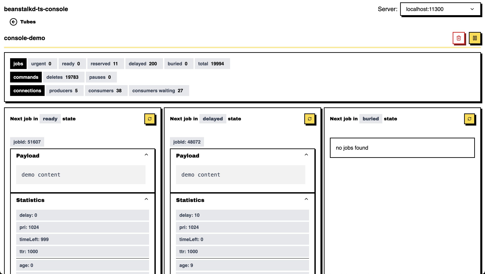
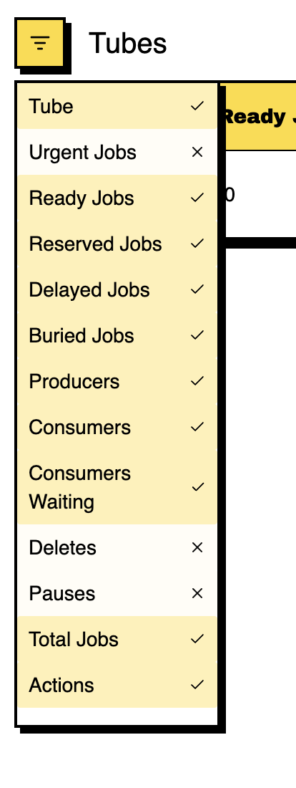

# beanstalkd-dashboard


beanstalkd-dashboard is a monitoring tool for [beanstalkd](https://github.com/beanstalkd/beanstalkd) servers.

## Installation & Usage

Install:
```sh
npm i -g beanstalkd-dashboard
```

Run and open [http://localhost:3000](http://localhost:3000):
```sh
beanstalkd-dashboard # listens on
```

Listen on specific host/port:
```sh
beanstalkd-dashboard --host 0.0.0.0 --port 1234
```

Connect to multiple servers:
```sh
beanstalkd-dashboard --servers localhost:11300,beanstalkd1:11300,beanstalkd2:11300
```


### Features

#### View All Tubes And Their Stats


#### Manage multiple beanstalkd servers.
Use `--servers` option to provide multiple beanstalkd server addresses so you can easily manage and monitor them from a single place.



#### View Tube Details

- All the stats about the jobs, executed commands and connections of the tube (automatically refreshed).
- The next job in `ready`, `delayed` and `buried` states.



#### Pause & Resume Tubes and Display Remaining Time to Resume

https://github.com/user-attachments/assets/af40b3d4-7da4-4855-a2bb-410df8d54209

#### Show/Hide Table Columns


#### [beanstalkd-pi](https://github.com/fatihky/beanstalkd-pi) support

Connecting to a [beanstalkd-pi](https://github.com/fatihky/beanstalkd-pi) server (a wire-compatible
beanstalkd reimplementation with a few extra commands) unlocks extra UI, automatically detected per
server via its "capabilities" command — nothing to configure. Against stock beanstalkd, none of
this appears and everything behaves exactly as before:

- A **dead-letter routing** (`set-dlq`) action on each tube, alongside the usual pause/clear.
- A **Connections** page (linked from the header) listing every connection to the server, the
  tube it uses/watches, and its reserved jobs — beanstalkd has no other way to inspect this.
- A **Ping** button on the server stats page, showing round-trip latency.
- Clearing a tube purges it in one round trip (`delete-tube`) instead of peek+delete-ing every job.
- A **job browser** on the tube details page (`list-jobs`): list a tube's ready, delayed or buried
  jobs (not just the next one), then click a job to see its body and stats, or delete it.
- A **Drain** toggle on the server stats page (`drain`): reject new jobs while workers keep
  processing the existing ones.
- The tube list loads every tube's stats in one round trip (`stats-tube-all`) instead of
  list-tubes + one stats-tube per tube.

### Tech Stack
- TypeScript
- [beanstalkd-ts](https://github.com/fatihky/beanstalkd-ts): beanstalkd client with full typescript support. (still in beta)
- [trpc](https://github.com/trpc/trpc)
