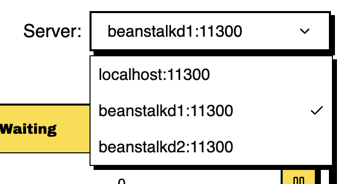

# beanstalkd-dashboard

beanstalkd-dashboard is a monitoring tool for [beanstalkd](https://github.com/beanstalkd/beanstalkd) servers.

### Tech Stack
- TypeScript
- [beanstalkd-ts](https://github.com/fatihky/beanstalkd-ts): beanstalkd client with full typescript support. (still in beta)
- [trpc](https://github.com/trpc/trpc)

### Features

#### View All Tubes And Their Stats

#### Manage multiple beanstalkd servers.
Use `--servers` option to provide multiple beanstalkd server addresses so you can easily manage and monitor them from a single place.

#### View Tube Details

- All the stats about the jobs, executed commands and connections of the tube (automatically refreshed).
- The next job in `ready`, `delayed` and `buried` states.

#### Pause & Resume Tubes and Display Remaining Time to Resume

<video controls src="./assets/beanstalkd-dashboard-pause-resume-tube.mp4"></video>

#### Show/Hide Table Columns

